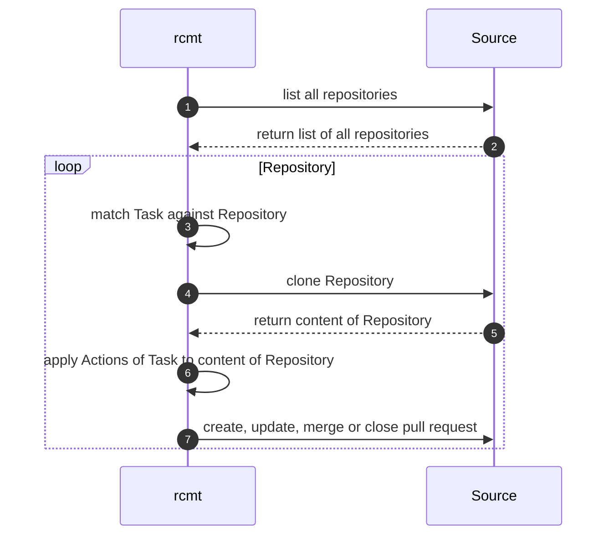

# How it works

## Flow of a rcmt run

```mermaid
sequenceDiagram
    autonumber
    rcmt->>Source: list all repositories
    Source-->>rcmt: return list of all repositories
    loop Repository
        rcmt->>rcmt: match Task against Repository
        rcmt->>Source: clone Repository
        Source-->>rcmt: return content of Repository
        rcmt->>rcmt: apply Actions of Task to content of Repository
        rcmt->>Source: create, update, merge or close pull request
    end
```
